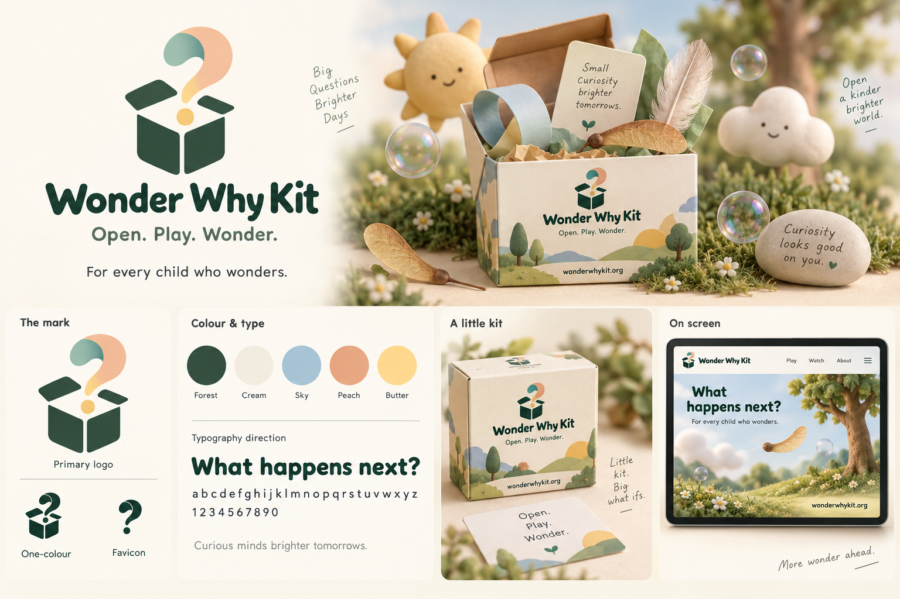

# Branding concept v1

Created using the built-in image-generation tool. Raster concept for review; not production vector artwork or a selected font specification.

The agreed copy remains **Open. Play. Wonder.** and **For every child who wonders.** Extra decorative phrases are exploratory only. Packaging and website views are mockups. Final logo variants need consistent vector construction and small-size checks.

## Generation prompt

Use case: logo-brand. Create a polished landscape branding concept sheet for WONDER WHY KIT, a playful nonprofit initiative for children ages 8–12: small hands-on kits, browser worlds and videos. The core feeling is delight first, curiosity next. Match a soft tactile 3D miniature clay-toy world: rounded matte forms, cream, sage, mint, peach, buttery yellow, sky blue, gentle ambient shadows, sophisticated editorial composition. Not toddler branding.
A spacious beautifully composed brand board on warm ivory, with a large hero identity occupying upper left and an inviting miniature playful still life upper right; organized lower panels showing logo variants, palette, typography direction, small kit packaging and a video end-card/website preview.
Design one distinctive cohesive logo: an open rounded little box with a curling question-mark-shaped ribbon emerging, a small round dot floating below the curl; simple recognizable silhouette. Primary logo as flat clean forest-green mark and friendly rounded wordmark, while the supporting illustration uses clay 3D. Show small one-colour and favicon versions of the SAME mark.
Hero wordmark EXACT "Wonder Why Kit", tagline EXACT "Open. Play. Wonder.", supporting mission EXACT "For every child who wonders." Domain on packaging/end card EXACT "wonderwhykit.org".
Supporting tactile objects: translucent soap bubbles, a maple helicopter seed, folded paper loop, small feather, soft sun and cloud, all arranged with restraint around open kit. No lab equipment or educational clichés. Kit is small cream square carton with charming brand sleeve, also a small instruction card. Grass blends softly, no sliced soil blocks.
Lower panel labels: "The mark", "Colour & type", "A little kit", "On screen". Palette five swatches labelled "Forest", "Cream", "Sky", "Peach", "Butter". Typography sample "What happens next?" in clear friendly rounded sans. On-screen mockup may show tree, a seed and meadow in soft 3D, with a small brand header, ample negative space. Clear visual hierarchy, professional brand studio presentation, readable concise typography. No text containing science, experiment, classroom. No fake claims, no QR code, no trademark symbol. This is a concept sheet, not a crowded asset catalogue. Render with exquisite care and consistent logo across applications.

